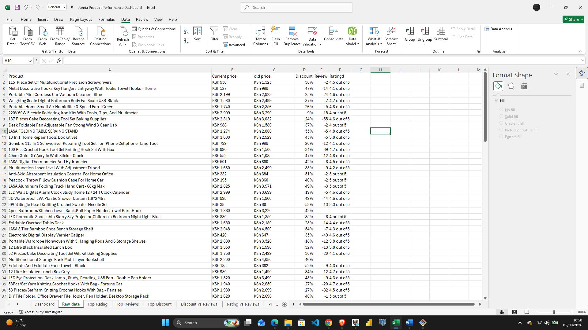
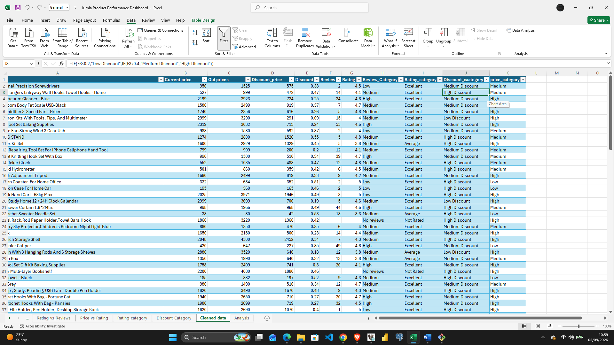
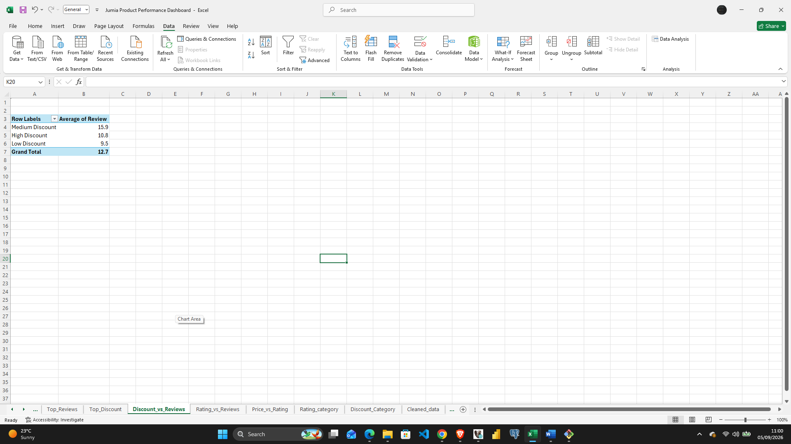
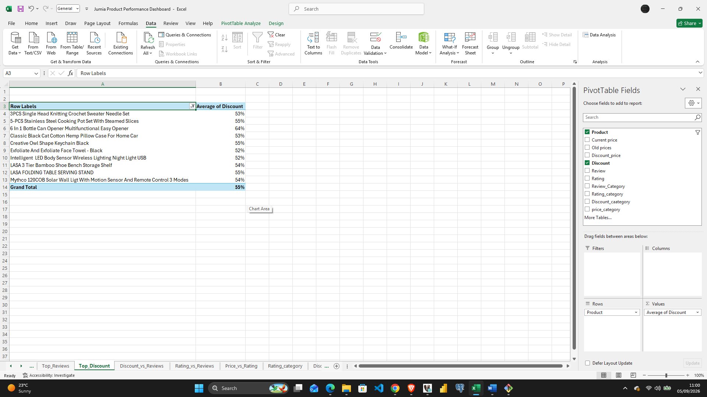

# Jumia Product Performance Dashboard

## Overview
This project analyzes product performance data scraped from Jumia Kenya (an e-commerce platform) to uncover relationships between pricing, discounts, customer ratings, and review engagement. The goal is to identify which products are performing well, which need attention, and what patterns (if any) drive customer engagement — delivered as an interactive Excel dashboard with pivot tables, pivot charts, and slicers.

**Dataset:** 112 products scraped from Jumia Kenya, covering product name, current price, old price, discount price, discount %, review count, and rating.

## Process

### 1. Data Cleaning
The raw scraped data required several fixes before analysis:
- Converted text-formatted prices into numeric values
- Extracted numeric ratings from descriptive text fields
- Corrected negative/invalid review counts
- Handled 55 products with no review/rating data (49% of the catalog) — these were explicitly labeled "No reviews" / "Not Rated" rather than dropped, since their absence is itself a finding

### 2. Feature Engineering
Added four calculated category columns to enable pivot-based analysis:
- **Review_Category** — Low / Medium / High / No reviews (based on review count)
- **Rating_category** — Poor / Average / Excellent / Not Rated (based on rating)
- **Discount_category** — Low / Medium / High Discount (based on discount %)
- **price_category** — Low / Medium / High / Premium (based on quartile price bands)

### 3. Pivot Table Analysis
Built 8 pivot tables from a single shared data source (`tblCleaned` table), enabling synchronized filtering via slicers:
- Top 10 by Rating, Reviews, and Discount
- Discount vs. Reviews, Rating vs. Reviews, Price vs. Rating (trend relationships)
- Rating category breakdown, Discount category breakdown

### 4. Interactive Dashboard
Assembled KPI cards, 8 pivot charts, and 3 slicers (Rating category, Discount category, Price category) onto a single dashboard sheet, allowing filtered exploration of the full dataset.

## Key Findings

**Overview KPIs**
| Metric | Value |
|---|---|
| Total products | 112 |
| Average price | KSh 1,201 |
| Average discount | 37% |
| Average rating (rated products only) | 3.9 |
| Total reviews | 723 |

**Trend Analysis**
- **Discount vs. Reviews:** correlation ≈ -0.14 — higher discounts do **not** lead to more reviews
- **Rating vs. Reviews:** correlation ≈ +0.06 — highly rated products do **not** get meaningfully more reviews
- **Price vs. Rating:** correlation ≈ +0.15 — expensive products are only marginally rated higher than cheaper ones

**Engagement**
- Only **16 of 112 products (14%)** reach "strong engagement" (14+ reviews)
- **90% of heavily discounted products (40%+ off)** show low or no engagement — discounting is not converting into demand for most of this catalog
- **49% of the entire catalog has zero reviews**, regardless of price or discount

**Top and bottom performers**
- Highest-rated products (5.0★) mostly have very few reviews (1-3) — small sample size, worth noting
- Lowest-rated products (2.0-2.2★) have more review volume backing them up (6-13 reviews), making these ratings more reliable
- The **120W Cordless Vacuum Cleaner** stands out as the most-reviewed product (69 reviews) but rates only 2.8★ — high visibility, low satisfaction

## Business Insights

**Are higher discounts leading to higher customer engagement?**
No. Discount percentage and review count are essentially uncorrelated. Steep discounting alone is not an effective lever for driving customer engagement on this platform.

**Do highly rated products have higher or lower prices?**
Barely any relationship either way. Mid-to-upper priced products (KSh 1,190–1,820) show the highest average rating (~4.2), but the effect is weak and not linear — price is not a reliable predictor of customer satisfaction.

**Which products are performing best based on reviews and ratings?**
Products combining strong review volume *and* high ratings include the 137pc Cake Decorating Tool Set, Electronic Digital Vernier Caliper, 3D Waterproof Shower Curtain, and various crochet/knitting hook sets — these represent genuine, validated customer favorites.

**Which products may need improved pricing strategies?**
47 of 62 heavily-discounted products (76%) show low or no engagement despite steep price cuts — suggesting the issue is visibility/marketing rather than price. Separately, a small group of products (120W Vacuum Cleaner, Agapeon Toothbrush Holder, VIC Wireless Vacuum, LED Night Light) attract high review volume but rate poorly (2.6–2.9★) — these need quality or expectation-management fixes, not price changes.

## Recommendations for Jumia Sellers

1. **Don't rely on discounting alone to drive traffic.** The data shows no meaningful link between discount depth and customer engagement — pair discounts with better product visibility, targeted marketing, or bundling instead.
2. **Investigate high-review, low-rating products urgently.** Products like the 120W Cordless Vacuum Cleaner get significant traffic but disappoint customers at scale — this is the highest-priority fix since the sample size (69 reviews) rules out random noise.
3. **Treat 5.0★ ratings with caution when review counts are low.** Several "perfect" ratings rest on just 1-3 reviews; sellers should keep encouraging reviews to build more statistically reliable reputations.
4. **Prioritize getting reviews on the ~49% of unrated catalog.** Nearly half of all products have no customer feedback at all — consider review-incentive campaigns for these listings specifically, since they're currently invisible to prospective buyers.
5. **Use the mid-to-upper price tier as a benchmark**, not the cheapest tier — it shows the best average satisfaction, suggesting there's room to compete on value rather than racing to the bottom on price.

## Tools Used
- Microsoft Excel — data cleaning, PivotTables, PivotCharts, Slicers, conditional formatting
- Git / GitHub — version control and project hosting

## Files in this Repository
- `dashboard/jumia_product_dashboard.xlsx` — full workbook: raw data, cleaned data, pivot tables, and interactive dashboard
- `data/Excel_jumia_dataset.csv` — cleaned dataset in CSV format
- `images/` — screenshots documenting the process (raw data → cleaned data → pivot tables → final dashboard)